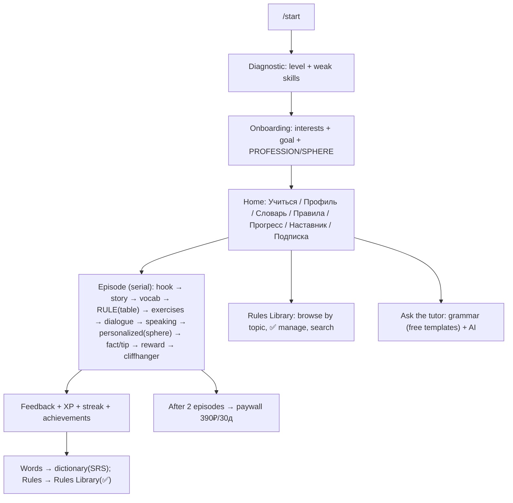

# English Mentor — Product Concept & Content Structure

**Last updated:** 2026-07-07  
**Purpose:** Single source of truth for product vision, **the ongoing serial story**,
implementation status, and a **copy-paste prompt** to continue work in a new Cursor chat
when context memory runs out.

> **⚠️ Locked behavior rules:** see [`docs/PRODUCT_INVARIANTS.md`](PRODUCT_INVARIANTS.md) —
> TTS on all English, STT fallbacks, tutor grammar, Spirit persona. **Do not break these
> when implementing changes.**

> **🎯 North star & daily program v2:** [`docs/DAILY_PROGRAM_V2.md`](DAILY_PROGRAM_V2.md) —
> personalized plan per level/interests/schedule, interactive practice, motivation roadmap.
> **Agreed build order:** Phase 1+2 (progress UX + onboarding sizing) → Phase 3 (roadmap).

---

## North star (do not lose this between sessions)

**We are building a maximum-filled app that gives each user a high-quality, personal English program.**

| What learners get | How we deliver it |
|-------------------|-------------------|
| Program fits **their level** | Diagnostic + CEFR → lessons, rules map, exercise difficulty |
| Program fits **their interests** | Preset interests + **free-text** `interests_custom` → topics, AI examples, warmup bias |
| Program fits **their life** | `daily_minutes` (20/30/60), study days/week, rest day (default Sunday) |
| **Interactive** training | Quizzes, exercises, speaking, listening, dialogue — not passive reading |
| **Quality** theory & examples | Bilingual tables, real words only, 🔊 every English phrase |
| **Motivation** | Visible progress, realistic «path to B1», streaks/XP, cool Spirit + serial story |

**One serial for everyone** (Emma's story). Personalization = *how* they practice inside that story,
not a different plot per user.

When we change the product, **extend structure — don't break it.** See invariants + v2 safe-change protocol.

---

Locked decisions (agreed with product owner):

1. **Content model: curated core + AI personalization.** We hand-author high-quality
   lesson templates; AI personalizes examples/exercises to the learner's interests
   and professional sphere, and generates extra practice. Cheap model, cached, budget-capped.
2. **Format: a continuous serial.** One ongoing story with recurring characters
   (Emma + others). Each lesson is the next *episode*, ending on a cliffhanger.
3. **Sphere profiling in onboarding.** We ask the learner's field (e-commerce, IT,
   hospitality, food, teaching, psychology, …) and bias some content to it.
4. **Trial episodes must hook the user** — bilingual rules as tables, translations
   everywhere, richer dialogue, facts/psychology tips, sphere-personalized practice.

---

## 1. The experience we're building

A learner opens the bot and is **pulled into a story**. They meet Emma, travel
through episodes, and along the way:

- learn words (with translations + audio + context, saved to a personal dictionary),
- learn rules shown as **clean bilingual tables** they can ✅ mark as "learned"
  and revisit in a personal **Rules Library**,
- do varied, interactive **exercises** (choice, gaps, word order, writing, speaking,
  AI dialogue) with instant feedback,
- get sprinkled **real facts, psychology tips, and positive notes** that make it feel human,
- occasionally practice **their own professional sphere** (e.g. an e-commerce email),
- see **progress, XP, streaks, achievements** and a rich **profile**.

The goal: after 2 free episodes the learner is hooked — they've built a dictionary,
ticked some rules, seen their progress, and want the next episode. Then the paywall.



---

## 2. Content architecture

### Lesson = episode = ordered `LessonStep`s

We keep the existing `Lesson`/`LessonStep` engine (`content_app/models.py`, 15 step
types) and **enrich the `content` JSON schemas** rather than adding many models.

Key step schemas (curated, authored as data in `content_app/curriculum.py`):

- **hook** — Russian teaser that sets the scene.
- **story** — narrative beat; can carry a `photo`/media and a recurring `character`.
- **vocabulary** — `words: [{en, ru, example, example_ru}]` (translations + context; TTS voices EN).
- **grammar_note** — **bilingual, table-first**:
  ```json
  {
    "title": "Вежливые просьбы",
    "rule_ru": "Короткое объяснение по-русски.",
    "table": {"headers": ["Форма","Пример","Перевод"],
              "rows": [["I would like…","I would like a coffee.","Я бы хотел кофе."]]},
    "examples": [{"en":"I would like tea.","ru":"Я бы хотел чай."}],
    "tip_ru": "Мягче, чем I want.",
    "rule_key": "polite-requests"   // links to the Rules Library
  }
  ```
- **dialogue** — scripted lines `[{speaker, text, ru}]` (EN voiced, RU shown).
- **exercise** — `exercise_type` ∈ {multiple_choice, true_false, fill_gap, word_order,
  short_answer, writing}. May set `"personalize": true` → AI swaps in a sphere/interest
  variant at runtime (cached, budget-capped, deterministic fallback).
- **speaking / ai_dialogue** — voice practice and character role-play.
- **fact / tip** (rendered via `reflection`/`story` with an emoji marker) — real facts,
  psychology, positive notes. Copyright-safe, original.
- **reward / cliffhanger** — gamified close + tease of the next episode.

### Curated core + AI personalization

- **Curated** lives in `content_app/curriculum.py` (units → episodes → steps). This is the
  quality backbone and is fully reviewable/editable.
- **AI personalization** (`ai_app/services/personalize.py`) fills `"personalize"` exercises
  and generates bonus practice, using: CEFR level + weak skill + **sphere/interest** as topic.
  Always cached per (level, skill, topic) and capped by the per-user daily budget; falls back
  to a deterministic bank on error/over-budget so a lesson never breaks.

### The serial (overview)

- A `Unit` groups episodes per level; episodes are ordered and connected by story.
- Recurring cast starts with **Emma**; we add characters over time (all original — no copyrighted material).
- Each episode ends on a **cliffhanger** referencing the next.

**Full story bible, episode log, and cast → see §8 below.**

---

## 3. User model — what we collect (and why it won't bore)

On `UserProfile` (`users_app`):

- `cefr_level`, `weak_skills` — from the diagnostic (adaptive).
- `interests` (M2M `Interest`) — topics for flavor/story.
- `learning_goal` — travel / work / study / …
- `profession` (**new**) — sphere for professional-bias content (e-commerce, IT, hospitality, food, teaching, psychology, medicine, finance, marketing, other).

Onboarding order (kept short, each step skippable): **goal → interests → sphere**. We
collect more *implicitly* over time (weak skills from attempts, favorite topics from
choices) instead of long questionnaires.

---

## 4. Rules Library (personal grammar knowledge base)

Goal: the learner reads a rule (as a table), ticks ✅ "выучил", and it lands in a
personal library they can browse by topic, search, add/edit/remove.

Planned model (`content_app` + a user-progress link):

- `GrammarRule`: `key`, `topic`, `title`, `level`, `summary_ru`, `table` (JSON),
  `examples` (JSON, bilingual), `is_published`.
- `UserRule`: `user`, `rule`, `status` (new/learned), `note` (user's own note),
  `updated_at`; supports the personal checkmark list + custom notes.

UI: a `📖 Правила` section — list topics → rules; each rule shows the table + ✅ toggle;
search by keyword; "мои правила" filter; edit personal note. Grammar steps in lessons
carry `rule_key` so ✅-ing in a lesson updates the library.

---

## 5. Dictionary (already wired) — how it fills

- Words are harvested automatically from completed episodes into `progress_app.UserWordProgress`.
- Review uses spaced repetition (RU→EN, audio, context). Next: show multiple translations
  and let the learner add their own words + tag by episode.

---

## 6. Roadmap (step by step)

### Done in code (as of 2026-07-05, session 2)

- Menu, profile, dictionary+SRS, tutor, adaptive lesson ranking, admin visibility.
- Grammar rules as **bilingual HTML tables** (`handlers._grammar_html`).
- **Sphere** (`UserProfile.profession`) + onboarding goal → interests → sphere.
- **AI-personalized exercise** in lessons (`content.personalize: true` → `personalize.py`).
- **2 trial episodes rewritten** + bonus lesson "Ordering Food" (paid, not trial).
- **Daily plan (checklist)** — `study_app/services/daily_plan.py`; «📚 Учиться» shows
  personalized plan, not a lesson picker. Each day: fact → episode → words → rules.
- **Rules Library** — `GrammarRule` + `UserRule`, `📖 Правила` map UI, ✅/🟢 in lessons.
- **Rule drill** (sparrow-style MC) from plan or rules map.
- **Notifications** — onboarding prompt + profile setting + `send_reminders` command.
- Concept doc (this file), curriculum in `content_app/curriculum.py`.

### Next (product owner priority TBD)

1. **Expand the serial** — Episode 3+ (hotel check-in), photos, more cast.
2. **Richer rule training** — more drill types, filter by topic on the map.
3. **Exercise bank** + AI generation pipeline per skill/level/sphere.
4. **YooKassa go-live** when moderation clears (`PAYMENT_MODE=live`); no auto-renewal yet.
5. **Cron on VPS** — `send_reminders` every hour; bot `runbot` 24/7.

---

## 7. Guardrails

- **Economical AI:** deterministic-first, cheap model for generation/checks, caching,
  per-user daily budget, graceful fallbacks.
- **Copyright-safe:** original characters/scenes/facts only; no copied media or text.
- **Bilingual by default:** every English rule/example carries a Russian translation.

---

## 8. Living story bible (current serial)

> **Authoring source of truth for episode text:** `content_app/curriculum.py`  
> After edits run: `python manage.py seed_content`

### Logline

A Russian-speaking learner arrives in the UK. **Emma** (friendly London guide) helps them
survive real situations — cafés, flights, hotels, work — episode by episode. The learner
builds vocabulary, grammar, and confidence while the plot pulls them forward.

### Cast (original characters)

| Character | Role | Appears in |
|-----------|------|------------|
| **Emma** | Warm, patient guide; a little playful. Main recurring mentor. | Ep.1 (guide), Ep.2 (mentioned — flight tomorrow) |
| **Tom** | Barista at the corner café | Ep.1 |
| **Sophie** | Fellow passenger; loves meeting people, flying to a conference | Ep.2 (AI dialogue + scripted lines) |
| **James** | Hotel receptionist in Manchester | Ep.3 |
| **Learner ("you")** | POV — shy at first, growing confident | All episodes |

*Future cast (planned):* colleagues/boss in Manchester, sphere-specific NPCs.

### Story arc (macro)

```
London (A1) → flight to Manchester (A2) → Manchester hotel + first work talk (A2/B1) → …
```

Tone: light, encouraging, **real facts** + **psychology tips**, no melodrama. Cliffhangers
tease the *next situation*, not soap-opera twists.

### Units & episodes (published in DB)

#### Unit: **Первые шаги в городе** (`a1-city-basics`, level A1)

| # | Title | Trial? | Status | What happens |
|---|-------|--------|--------|--------------|
| 1 | **Coffee in London** | ✅ yes | **Live** | Rainy London morning. Emma waves you over, leads you to a café. Tom the barista. Learn polite requests (`I would like…`, `please`). Fact: ~98M cups of coffee/day in UK. Psychology: mistakes while speaking are OK. **Cliffhanger:** tomorrow you fly to Manchester — someone will talk to you on the plane. |
| 2 | **Ordering Food** | no (paid) | **Live** (content only) | Café/restaurant: menu, order, bill. Grammar: `Can I have …, please?` table. Not part of free trial funnel. |

**Grammar keys introduced:** `polite-requests` (Ep.1, Ep.2 food lesson reuses same key).

#### Unit: **Знакомства и общение** (`a2-meeting-people`, level A2)

| # | Title | Trial? | Status | What happens |
|---|-------|--------|--------|--------------|
| 1 | **Meeting on a Plane** | ✅ yes | **Live** | Flight to Manchester. **Sophie** sits next to you: "Is this seat taken?" Scripted bilingual dialogue + AI chat (4 turns). Grammar: Present Simple questions table (`do/does`, `Where are you from?`). **Personalized exercise** from learner's sphere. Writing: 1–2 sentences about yourself. Psychology: people like when you ask about them. **Cliffhanger:** in Manchester — hotel check-in and first **work conversation**. |

**Grammar keys introduced:** `present-simple-questions`.

#### Unit: **Манчестер: отель** (`a2-manchester-hotel`, level A2)

| # | Title | Trial? | Status | What happens |
|---|-------|--------|--------|--------------|
| 1 | **Hotel Check-in** | no (paid) | **Live** | Tired after flight. **James** at reception. Vocab: reservation, key, lift, breakfast. Grammar: `hotel-check-in`. Matching, speaking, sphere personalize. **Cliffhanger:** first work day tomorrow. |

**Grammar keys introduced:** `hotel-check-in`.

### Next episode(s) to write (not in DB yet)

**Episode 4 (planned)** — *First Day at Work* (A2→B1)

- Small talk with colleagues, "What do you do?", sphere-heavy vocab.
- Optional branch flavor by `profession` (IT standup phrases vs hotel shift handover vs teacher staff room).

### Recurring content ingredients (use in every episode)

- **hook** — scene + stakes in Russian.
- **story** — 1–2 beats with a named character.
- **vocabulary** — `en / ru / example / example_ru`, 🔊 English only.
- **grammar_note** — `rule_ru` + **table** + bilingual `examples` + `tip_ru` + `rule_key`.
- **dialogue** — scripted lines with `ru` under each English line.
- **exercises** — mix of MC, gap, word order, speaking, writing, optional `personalize: true`.
- **ai_dialogue** — 3–4 turns with a character when it fits.
- **reflection** — psychology tip OR real fact (copyright-safe).
- **reward** — XP celebration + dictionary mention.
- **cliffhanger** — explicit tease of next episode.

---

## 9. Implementation status (for developers)

| Area | Status | Key files |
|------|--------|-----------|
| Bot menu & commands | ✅ | `telegram_app/bot/keyboards.py`, `handlers.py` |
| Diagnostic + adaptive level | ✅ | `handlers.py`, `db.py` |
| Onboarding goal → interests → sphere | ✅ | `handlers.py`, `users_app/models.py` |
| Profile, progress, paywall 390₽ mock | ✅ | `handlers.py`, `billing_app/` |
| Grammar HTML tables | ✅ | `handlers._grammar_html`, `_table_html` |
| TTS (edge-tts) on English content | ✅ | `ai_app/tts/`, `handlers._speak_text_for_step` |
| Dictionary + SRS review | ✅ | `db.save_lesson_words`, `handlers` review flow |
| Tutor (grammar KB + AI) | ✅ | `ai_app/services/grammar.py`, tutor mode |
| Adaptive lesson ranking | ✅ | `db._rank_lessons` |
| AI practice after lesson + in-episode personalize | ✅ | `ai_app/services/personalize.py` |
| Curriculum / episodes | ✅ 4 lessons seeded | `content_app/curriculum.py`, `seed_content` |
| Daily plan (checklist) | ✅ | `study_app/services/daily_plan.py`, `handlers.show_daily_plan` |
| Rules Library UI | ✅ | `GrammarRule`, `UserRule`, `📖 Правила` |
| Notifications | ✅ MVP | `send_reminders`, `UserProfile.reminder_time` |
| Mini-series Ep.4+ | ❌ planned | story bible §8 |
| Photos / media in episodes | ❌ mostly empty | `MediaAsset`, attach in admin |
| YooKassa live | ❌ deferred | `PAYMENT_MODE=mock` in `.env` |
| Bot on VPS 24/7 | ❌ user runs locally | `manage.py runbot` — sleeps when PC sleeps |

**Run locally:** `migrate` → `seed_content` → `runbot`  
**Tests:** `python manage.py test ai_app study_app`

---

## 10. Continuation prompt (copy into a new Cursor chat)

When this chat's context is full, start a **new chat** and paste the block below.
Attach or mention `docs/PRODUCT_CONCEPT.md` and optionally `content_app/curriculum.py`.

```
You are continuing development of **English Mentor Bot** — a Telegram Django bot
for Russian-speaking learners in Russia.

**Read first:** `docs/PRODUCT_CONCEPT.md` (full product vision, story bible §8,
implementation status §9). Content lives in `content_app/curriculum.py`.

**Project:** Django + python-telegram-bot, apps: users_app, content_app, study_app,
billing_app, gamification_app, ai_app, progress_app. Legacy bot_app is retired.

**Locked product decisions:**
- Curated lesson templates + AI personalization (cheap model, cached, budget-capped).
- Continuous serial story with Emma; each lesson = next episode + cliffhanger.
- Onboarding: diagnostic → goal → interests → profession/sphere.
- Bilingual content: rules as HTML tables (RU explanation + EN/RU examples), vocab with example_ru.
- 2 free trial lessons then paywall 390₽/30 days (mock payments until YooKassa).

**Story so far (implemented):**
- Ep.1 Coffee in London (A1, trial): Emma + barista Tom, polite requests. Cliffhanger: flight tomorrow.
- Ep.2 Meeting on a Plane (A2, trial): Sophie, small talk, personalized sphere exercise. Cliffhanger: Manchester hotel.
- Ep.3 Hotel Check-in (A2, paid): James at reception, hotel vocab, rule `hotel-check-in`. Cliffhanger: first work day.
- Ep.4+ NOT written yet — see PRODUCT_CONCEPT.md §8.

**Already built:** menu, profile, TTS, dictionary+SRS, tutor, adaptive ranking, grammar tables,
sphere field, personalize exercises, admin inlines, 16 tests passing.

**Likely next tasks (confirm with user):**
1. Rules Library (GrammarRule + UserRule + 📖 Правила UI + ✅ from lessons)
2. Write Episode 3 (Manchester hotel check-in) in curriculum.py
3. More exercises / photos / sphere branches

**Conventions:** match existing code style; don't edit the roadmap plan file in .cursor/plans;
run migrate/seed_content after model/content changes; economical AI (deterministic-first).

**My request for this session:**
[PASTE WHAT YOU WANT HERE — e.g. "Build the Rules Library" or "Write Episode 3"]
```

Replace the last line with your actual task.

---
